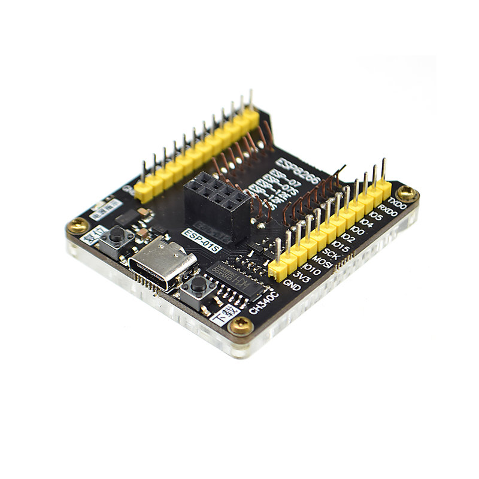

# funXquad
funXquad 是一個低成本、DIY（自己動手做）的無人機項目，專為教育用途設計。

!! 此專案僅授權用於個人非商業用途。嚴禁任何商業使用、分發或用於商業目的的修改。

## 專案目錄結構

以下是 funXquad 專案的主要目錄及其功能：

* `frames/`: 無人機機架的3D列印檔案。

* `v1/`: 專案的第一個版本。
    * `firmware/`: 存放無人機的韌體程式碼。
    * `hardware/`: 包含硬體設計檔案，例如電路圖或佈局檔案。

* `README.md`: 專案的說明文件，包含專案的基本資訊和目錄結構說明。

## DIY 材料清單

有室內和室外兩種類型，除電路板相同外，其餘零件不同。

* `電路板`:
    * `必要`:
        * `洞洞板`: 1個
        * `電池接頭`: 依電池規格 1個
        * `WiFi SOC`:
            * `v1`: ESP12S模組 1個
            * `v2`: 增加圖傳，努力中..
        * `IMU`: MPU6050模組 1個
        * `電晶體`: SI2302 或 NCE3420 4個
        * `二極體`: 1N4148 或 1N5819 4個
        * `電阻`: 1k歐姆以上 4個
        * `電量感測`； 10kΩ以上 1個 + 5倍阻值的電阻 1個
        * `電線`: 少許
    * `選用`:
        * `穩壓模組`: 如果MPU6050模組上沒有3.3V穩壓晶片, 就需要 1.8V-5V 轉 3.3V穩壓模組 1個
        * `室外高度計`: 3.3V BMP280模組 1個
        * `室內高度計`: VL53L0X模組 1個

* `機架`: 3D 打印，檔案在[ frames ](/frames)目錄內
    * `室內機`: typeA 需牙籤 1支，切割成10mm長度共 4支
    * `室外機`: 3mmx3mmx500mm 碳纖維空心方管 1支，切割成50mm長度共 4支

* `動力系統`： 需4組
    * `室內機`: 820或8520空心杯馬達直驅 55mm 或 40mm 螺旋槳。螺旋槳孔徑需搭配馬達軸徑，通常是 1mm
    * `室外機`: 馬達採用720空心杯 + 減速齒輪組 + 135mm 螺旋槳

* `電池`: 以下為實驗過的建議組合，注意電池和充電器接口需匹配
    * `室內機`: 3.8V 高壓 300mAh 75C 或 380mAh 60C 鋰電池 + 3.8V 充電器
    * `室外機`: 3.7V 600~1100mAh 20C + 3.7V充電器

## 所需工具
* `3D列印機`: 用於製作機架
* `燒錄器`: 用於燒錄韌體
* `焊接工具`: 用於製作電路板
* `熱熔膠槍`: 用於固定馬達，電路板和機架
* `橡皮筋`: 用於固定電池
* `安卓手機`: 用於遙控器安裝

## 製作機架

## 燒錄韌體
* `v1`: 
    * 韌體檔案 `firmware.bin` 在[ v1/firmware ](https://github.com/robot4fun/funXquad/tree/main/v1/firmware)目錄內，將其下載到電腦
    * 將`ESP12S模組`正確放入 `燒錄器` 中  (如果使用 `USB to TTL` 或 `開發板` 當燒錄器，請確保接線和電壓正確)

    * 以USB訊號線連接 `電腦` 和 `燒錄器`
    * 點選進入 [`燒錄工具網頁版`](https://espressif.github.io/esptool-js/)
    * 點選網頁 `Connect` 按鈕後選擇正確的`USB端口`，選擇 `ESP12S` 或 `ESP8266`

    * 點選網頁 `Start` 按鈕
    * 選擇要燒錄的韌體檔案 `firmware.bin`
    * 按住  `燒錄器` 上的 `下載` 按鈕開始燒錄韌體
    * 燒錄完成後釋放 `燒錄器` 上的 `下載` 按鈕並拔除 `USB` 線
    * 取下`ESP12S模組`

* `v2`: 增加圖傳，努力中..

## 製作電路板
* `v1`: 參照 [`原理圖`](v1/hardware/Schematic_funxdrone_v1.pdf) 和成品照自行加工

* `v2`: 增加圖傳，努力中..

## 組裝
* `室內機`: 
    
    * `TypeA`: 
    
    * `TypeB`:
    
    * `TypeC`: 

* `室外機`:  

## 遙控器
使用手機當遙控器，目前僅有安卓版

* `安裝`: 先在手機內設定允許安裝不明程式，下載 funXcon.apk 後安裝即可

* `使用說明`: 