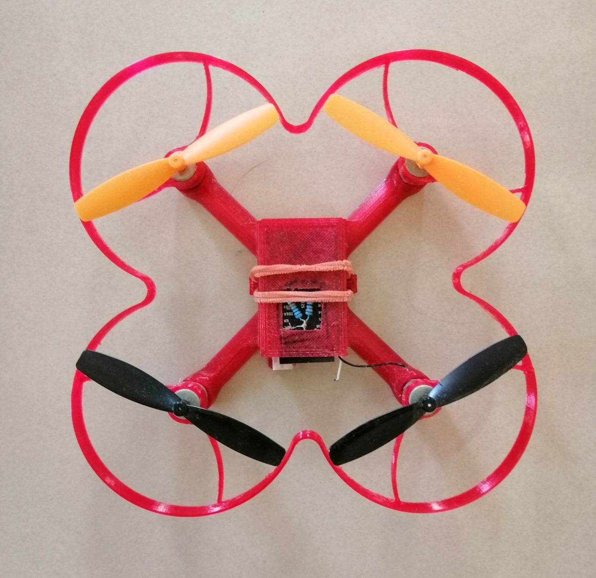
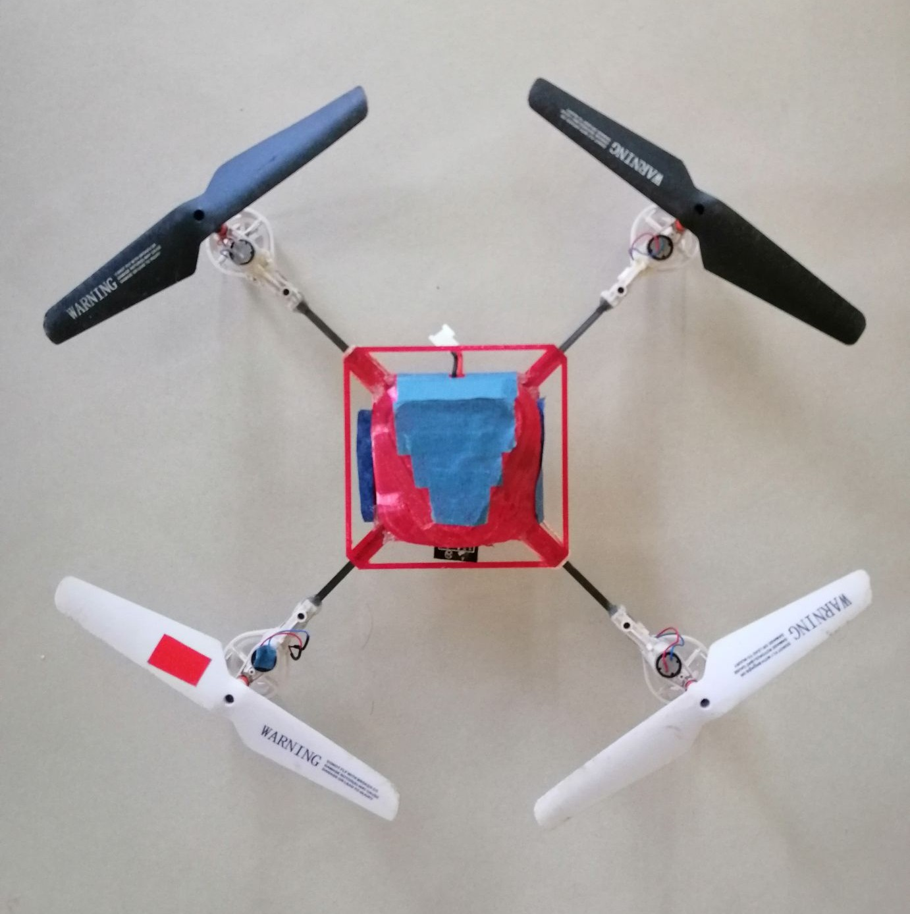

  <picture>
    <source media="(prefers-color-scheme: dark)" srcset="xedu-logo4-l-3.png">
    <source media="(prefers-color-scheme: light)" srcset="xedu-logo4-l-3.png">
    
  </picture>
   
   

funXquad 是一個低成本、DIY（自己動手做）的無人機項目，專為教育用途設計。

!! 此專案授權僅限個人或學校教學非商業用途。嚴禁任何商業使用、分發或用於商業目的之修改 !!

## 專案目錄結構

以下是 funXquad 專案的主要目錄及其功能：

* `frames/`: 無人機機架的3D列印檔案。

* `v1/`: 專案的第一個版本。
    * `firmware/`: 存放無人機的韌體檔案。
    * `hardware/`: 包含硬體設計檔案，例如電路圖或佈局檔案。

* `funXcon`: 遙控器程式及相關文件。

* `README.md`: 專案的說明文件。

## DIY 材料清單

有室內和室外兩種類型，除電路板相同外，其餘零件不同。

* `電路板`:
    * `必要`:
        * `洞洞板`: 1個
        * `電池接頭`: 依電池規格 1個
        * `WiFi SOC`:
            * v1: `ESP12S模組` 1個
            * v2: 增加圖傳，努力中..
        * `IMU`: `MPU6050模組` 1個
        * `電晶體`: SI2302 或 NCE3420 4個
        * `二極體`: 1N4148 或 1N5819 4個
        * `電阻`: 1k歐姆以上 4個
        * `電量感測`； 10kΩ以上 1個 + 5倍阻值的電阻 1個
        * `電線`: 少許
    * `選用`:
        * `穩壓模組`:  如果選擇帶有 `3.3V 穩壓晶片` 的 `MPU6050模組` ，可以直接拉出 `3.3V電源` 供電給WiFi SOC。如果沒有，就需要 `1.8V-5V 轉 3.3V 穩壓模組` 1個
        * `室外高度計`: 3.3V BMP280模組 1個
        * `室內高度計`: VL53L0X模組 1個

* `機架`:
    * `室內機`: typeD 需牙籤 1支，切割成10mm長度共 4支
    * `室外機`: 3mmx3mmx500mm 碳纖維空心方管 1支，切割成50mm長度共 4支

* `動力系統`： 需4組
    * `室內機`: 820或8520空心杯馬達直驅 55mm 或 40mm 螺旋槳。螺旋槳孔徑需搭配馬達軸徑，通常是 1mm
    * `室外機`: 馬達採用720空心杯 + 減速齒輪組 + 135mm 螺旋槳

* `電池`: 以下為實驗過的建議組合，注意電池和充電器接口需匹配
    * `室內機`: 3.8V 高壓 300mAh 75C 或 380mAh 60C 鋰電池 + 3.8V 充電器
    * `室外機`: 3.7V 600~1100mAh 20C + 3.7V充電器

## 所需工具
* `3D列印機`: 用於製作機架
* `燒錄器`: 用於燒錄韌體
* `焊接工具`: 用於製作電路板
* `熱熔膠槍`: 用於固定馬達，電路板和機架
* `橡皮筋`: 用於固定電池
* `安卓手機`: 用於遙控器安裝

## 製作機架
* 3D 打印零件，檔案在[ frames ](/frames)目錄內
* `室內機`:
    * `TypeB`: 共3個打印件
    * `TypeD`: 共3個打印件
    * `TypeE`: 1個打印件

* `室外機`: 共3個打印件
* 初學者建議使用 `PETG` 線材，機架會較有彈性，耐撞摔

## 燒錄韌體
* `v1`: 
    * 韌體檔案 `firmware.bin` 在[ v1/firmware ](https://github.com/robot4fun/funXquad/tree/main/v1/firmware)目錄內，將其下載到電腦
    * 將`ESP12S模組`正確放入 `燒錄器` 中  (如果使用 `USB to TTL` 或 `開發板` 當燒錄器，請確保接線和電壓正確)

    * 以USB訊號線連接 `電腦` 和 `燒錄器`
    * 點選進入 [`燒錄工具網頁版`](https://espressif.github.io/esptool-js/)
    * 點選網頁 `Connect` 按鈕後選擇正確的`USB端口`，選擇 `ESP12S` 或 `ESP8266`

    * 點選網頁 `Start` 按鈕
    * 選擇要燒錄的韌體檔案 `firmware.bin`
    * 按住  `燒錄器` 上的 `下載` 按鈕開始燒錄韌體
    * 燒錄完成後釋放 `燒錄器` 上的 `下載` 按鈕並拔除 `USB` 線
    * 取下`ESP12S模組`

* `v2`: 增加圖傳，努力中..

## 製作電路板
* `v1`: 參照 [`原理圖`](v1/hardware/Schematic_funxdrone_v1.pdf) 和成品照自行加工 這張含 `穩壓模組` 

* `v2`: 增加圖傳，努力中..

## 組裝
* `室內機`: 
    
    * `TypeB`: 適用 `55mm` 螺旋槳 這張電路板不含 `穩壓模組` ，由 `MPU6050模組` 自帶的 `3.3V 穩壓晶片` 穩壓 這張照片的螺旋槳是 `60mm`  裝了 `高度計`

    * `TypeD`: 適用 `55mm` 螺旋槳    
   
    * `TypeE`: 適用 `40mm` 螺旋槳  

* `室外機`:    安裝了 `高度計` (電路凌亂，建議還是做好電路板再組裝)       

## 遙控器
使用手機當遙控器，目前僅有安卓版

* `安裝`: 先在手機內設定允許安裝不明程式，下載 `funXcon.apk` 後安裝即可

* `使用說明`: 
    * 無人機插上電池 (天線是無人機的尾部)
    * 因安卓系統問題，連接無人機的WiFi網路前須打開手機的 `定位服務` 並關閉 `行動數據`  
    * 按住 `插頭` 圖示不放以搜尋無人機，搜尋時圖示會變成 `雷達` 樣式 
    * 出現藍牙警示時任選即可 
    * 搜尋到無人機後放開點選 `雷達` 圖示，然後選擇要連線的無人機SSID `funXudp00xx` (如果失敗，重按 `雷達` 圖示不放重新搜索即可) 
    * 連接成功後 `雷達` 圖示會變成 `插頭插入插座` 樣式，確認安全後打開 `啟動開關` 啟動馬達 

    * 遙控器有四個控制桿，左邊是 `偏航`、`油門`，右邊是 `滾轉`、`俯仰` 
    * 電池電量不足時會響警報，關閉 `啟動開關` 會停止所有馬達
    * 不玩時請先關閉 `啟動開關` ，然後點選 `插頭` 圖示，等中斷連線後再拔除電池 

## 注意事項
            
    * 飛行中小心不要關閉 `啟動開關` ，否則............
    
    * 遙控器點選 `齒輪` 圖示會進入設定頁面，新手切勿修改設定值。

    * 飛行超出遙控信號範圍時會自動緩慢降低高度，下降過程若進入信號範圍可繼續遙控飛行。如果一直超出信號範圍會下降直至落地。
    
    * 如果安裝了`高度計`，可以打開 `定高開關` 定高飛行。但因為 `高度計` 的精度和算法問題，定高效果不會很好。新手不要輕易嘗試。